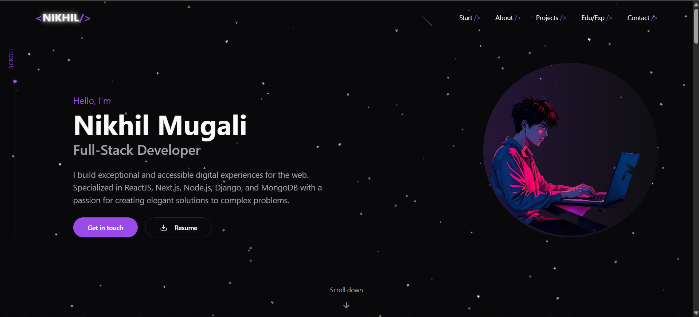

# Portfolio Website - v2.0

## Demo

Check out the live version of my portfolio at: [https://nikhilmugali-portfolio.vercel.app](https://nikhilmugali-portfolio.vercel.app)



---

## Badges

[](https://forthebadge.com)  
[](https://forthebadge.com)  
[](https://forthebadge.com)  
  


---

## TL;DR

Fork this repository to modify and customize as per your needs. Please give proper credit by linking back to [N1khilM](https://github.com/N1khilM/Portfolionew). Enjoy!

---

## Built With

My personal portfolio website, hosted at [https://nikhilmugali-portfolio.vercel.app](https://nikhilmugali-portfolio.vercel.app), showcases my GitHub projects, resume, and technical skills. This project was built using:

- **Next.js** (for SSR, SSG)
- **Tailwind CSS** (for styling)
- **React.js** (for interactivity)
- **Node.js** (for backend)
- **Vercel** (for deployment)

---

## Features

- **🖥️ Fully Responsive**  
  Looks great on desktops, tablets, and mobile devices.

- **🎨 Tailwind CSS for fast styling**  
  Clean, minimalistic, and customizable design with Tailwind's utility-first classes.

- **⚡ Fast & Optimized**  
  Pages are statically generated or server-side rendered for fast load times.

- **🌙 Dark Mode & Light Mode Toggle**  
  Automatically switches themes based on system preferences or manual selection.

- **💻 Projects Showcase**  
  Displays my GitHub repositories and project details dynamically.

- **📝 Contact**  
  Get in touch with me via the contact.

---

## Getting Started

### Prerequisites

Make sure you have `node.js` and `git` installed on your machine.

1. Clone this repository:

   ```bash
   git clone https://github.com/N1khilM/Portfolionew.git

   ```

2. Navigate into the project directory:

   ```bash
   cd Portfolionew

   ```

3. Install dependencies:

   ```bash
   npm install
   ```

# Running Locally

1. Start the development server:

   ```bash
   npm run dev

   ```

2. Visit http://localhost:3000 in your browser to see your portfolio live!

# Usage

- You can customize the content by modifying the following files:

  /app/page.tsx – Main landing page content.

  /components/Projects.tsx – List and details of your projects.

  /components/Contact.tsx – For updating the contact information.

  /styles/globals.css – Global styles and customizations.

To make your portfolio truly your own, feel free to add new components or tweak existing ones.

## Show Your Support

If you like this website, feel free to give it a ⭐️!

<a href="https://www.buymeacoffee.com/nikhilm" target="_blank"></a>

# License

This project is licensed under the MIT License - see the [LICENSE.md](./LICENSE.md) file for details.
